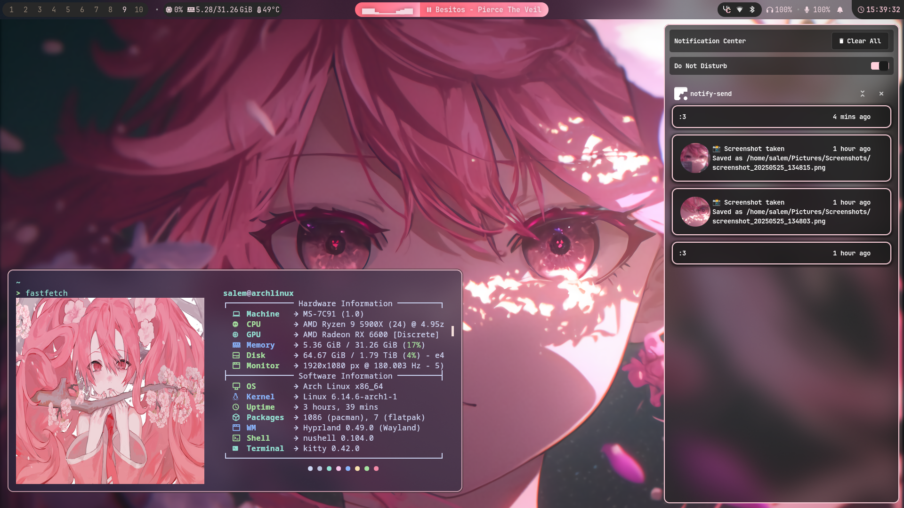
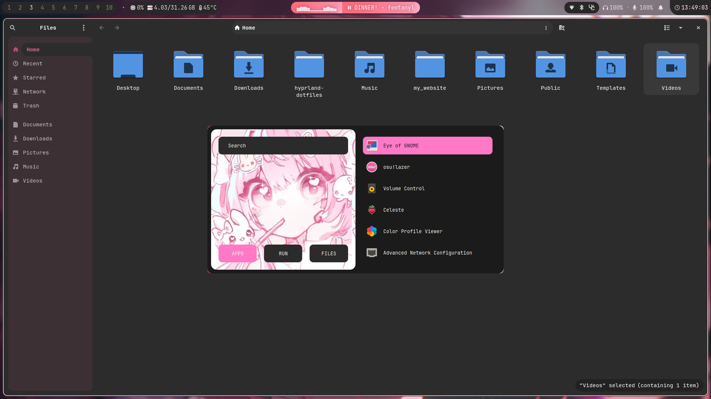
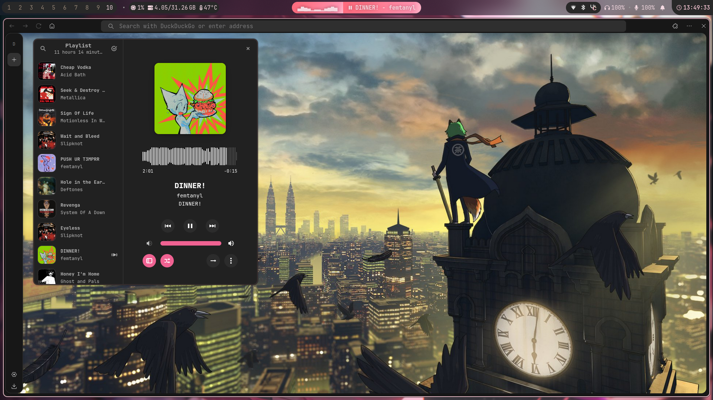
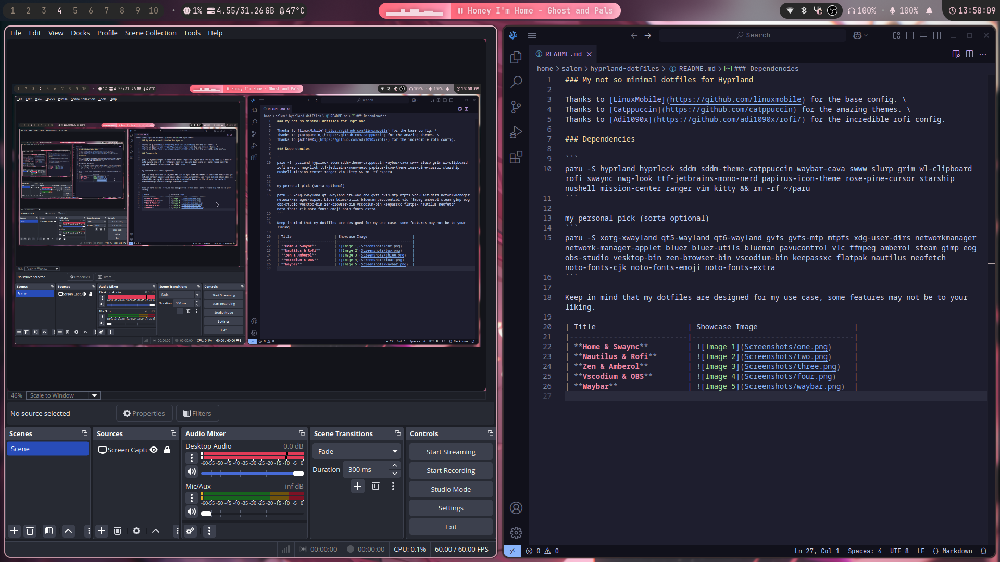

### My somewhat minimal dotfiles for Hyprland

Thanks to [LinuxMobile](https://github.com/linuxmobile) for the base config. \
Thanks to [Catppuccin](https://github.com/catppuccin) for the amazing themes. \
Thanks to [Adi1090x](https://github.com/adi1090x/rofi/) for the incredible rofi config.

### Showcase
<table>
  <tr>
    <td></td>
    <td></td>
  </tr>
  <tr>
    <td></td>
    <td></td>
  </tr>
</table>
<br>


### Run the installation script:
```
git clone https://github.com/seraphicfae/hyprland-dotfiles
cd hyprland-dotfiles
./setup.sh
```

### Manual installation:

#### Dependencies

```
paru -S hyprland hyprlock hyprpicker xorg-xwayland qt5-wayland qt6-wayland gvfs gvfs-mtp mtpfs \
xdg-user-dirs networkmanager network-manager-applet bluez bluez-utils blueman pavucontrol vlc \
ffmpeg amberol gimp eog obs-studio vesktop-bin zen-browser-bin vscodium-bin keepassxc flatpak \
nautilus fastfetch noto-fonts-cjk noto-fonts-emoji noto-fonts-extra sddm sddm-theme-catppuccin \
waybar swww slurp grim wl-clipboard rofi swaync nwg-look ttf-jetbrains-mono-nerd papirus-icon-theme \
starship nushell mission-center ranger vim cava kitty && rm -rf ~/paru
```
<sub>Psst, edit your /etc/pacman.conf for multilib so you can get steam</sub>

#### Steps
```
cd hyprland-dotfiles
cp -r .config/* ~/.config/
mkdir -p ~/.icons ~/.themes ~/.vscode-oss ~/.zen
cp -r .icons/* ~/.icons/
cp -r .themes/* ~/.themes/
cp -r .vscode-oss/* ~/.vscode-oss/
cp -r .zen/* ~/.zen/
```

#### Finalizing 
```
sudo systemctl enable --now NetworkManager bluetooth
sudo systemctl enable sddm
chsh -s /usr/bin/nu
reboot
```

> [!WARNING]
> This setup is designed for the desktop. Laptop users may find  unstable
> or broken functionality. Modules like `backlight`, `temperature` `battery`
> in Waybar do not behave the same. I do not have a laptop to test how
> these features will be implemented. This shouldn't be a major issue.

**Recommendation:** If you're on laptop, you can fix/write the code yourself. \
<sub>And please send it to me...</sub>