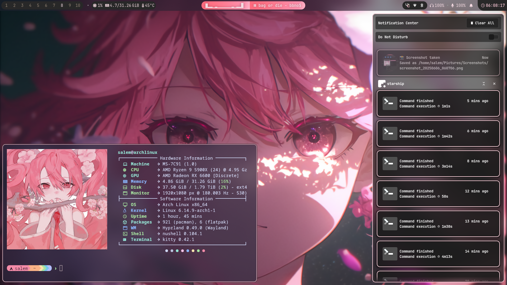
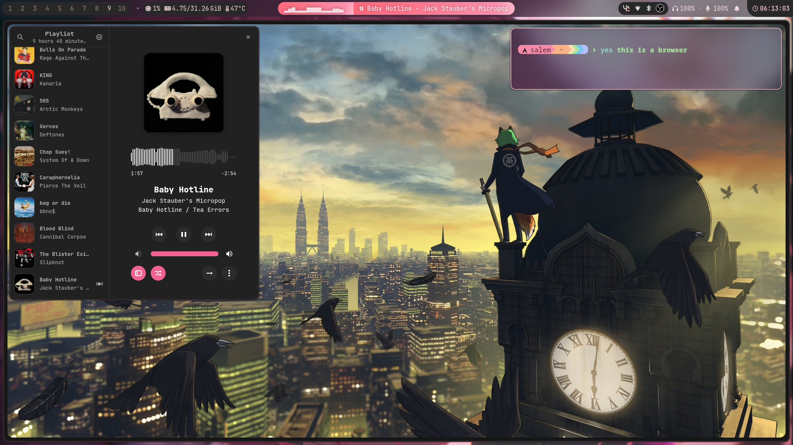
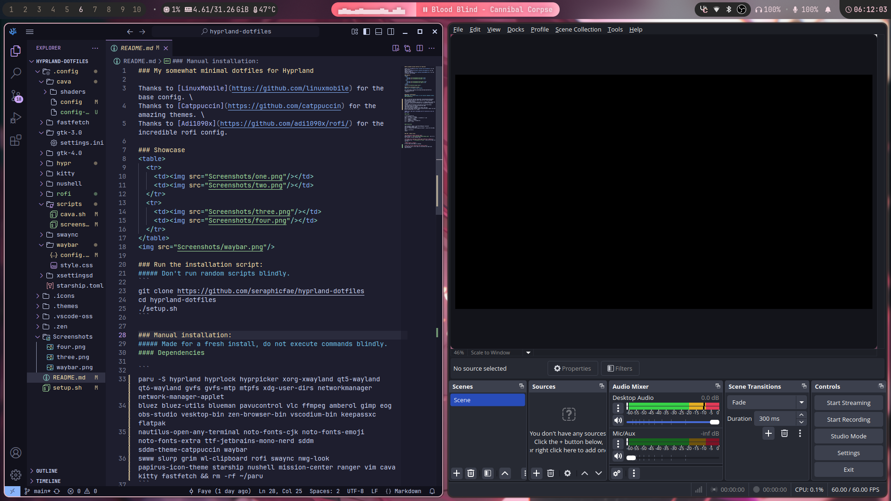
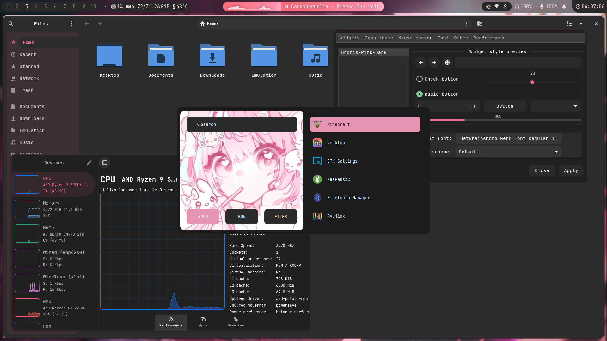
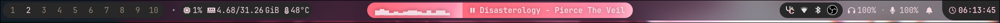

### My somewhat minimal dotfiles for Hyprland

Thanks to [LinuxMobile](https://github.com/linuxmobile) for the base config. \
Thanks to [Catppuccin](https://github.com/catppuccin) for the amazing themes. \
Thanks to [Adi1090x](https://github.com/adi1090x/rofi/) for the incredible rofi config.

### Showcase
<table>
  <tr>
    <td></td>
    <td></td>
  </tr>
  <tr>
    <td></td>
    <td></td>
  </tr>
</table>


### Run the installation script:
##### Don't run random scripts blindly.
```
git clone https://github.com/seraphicfae/hyprland-dotfiles
cd hyprland-dotfiles
./setup.sh
```

### Manual installation:
##### Made for a fresh install, do not execute commands blindly.
#### Dependencies

```
paru -S hyprland hyprlock hyprpicker xorg-xwayland qt5-wayland qt6-wayland gvfs gvfs-mtp mtpfs xdg-user-dirs networkmanager network-manager-applet bluez bluez-utils 
blueman pavucontrol vlc ffmpeg amberol gimp eog obs-studio vesktop-bin zen-browser-bin vscodium-bin keepassxc flatpak nautilus-open-any-terminal noto-fonts-cjk 
noto-fonts-emoji noto-fonts-extra ttf-jetbrains-mono-nerd sddm sddm-theme-catppuccin waybar swww slurp grim wl-clipboard rofi swaync nwg-look papirus-icon-theme 
starship zsh zoxide fzf fd bat mission-center ranger neovim cava kitty fastfetch && rm -rf ~/paru
```
###### Psst, edit your /etc/pacman.conf for multilib so you can get steam

#### Steps
```
cd hyprland-dotfiles
cp -r .config/* ~/.config/
mkdir -p ~/.icons ~/.themes ~/.vscode-oss ~/.zen
cp -r .icons/* ~/.icons/
cp -r .themes/* ~/.themes/
cp -r .vscode-oss/* ~/.vscode-oss/
cp -r .zen/* ~/.zen/
```

#### Finalizing 
```
sudo systemctl enable --now NetworkManager bluetooth
sudo systemctl enable sddm
echo -e "[Theme]\nCurrent=catppuccin-mocha" | sudo tee /etc/sddm.conf
chsh -s /usr/bin/zsh
ln -s ~/.config/zsh/.zshrc ~/.zshrc
reboot
```

### FAQ / Common Issues

**My temperature module doesn’t load**  
Default path is `/sys/class/hwmon/hwmon2/temp1_input`. Set it to your system's correct thermal zone.

**My theme isn't applying to GTK4 apps? (Nautilus & Amberol)**  
Try deleting the `~/.config/gtk-4.0 folder`, and set the theme via nwg-look.

**MPRIS module is empty**  
It only shows when media is playing.

**How can I set my resolution and refresh rate?** 
Via Hyprland.conf: scroll down to the bottom and input your specifications.  